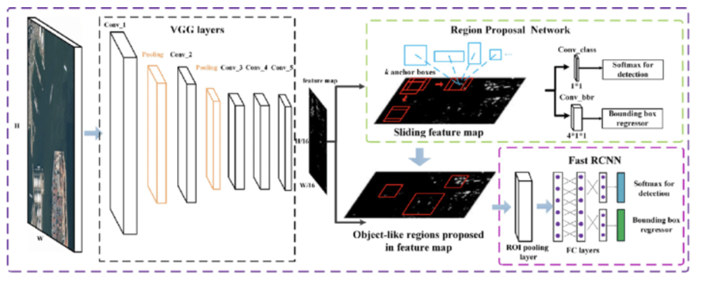
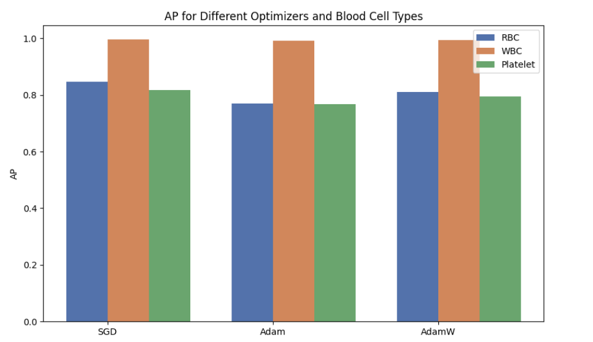
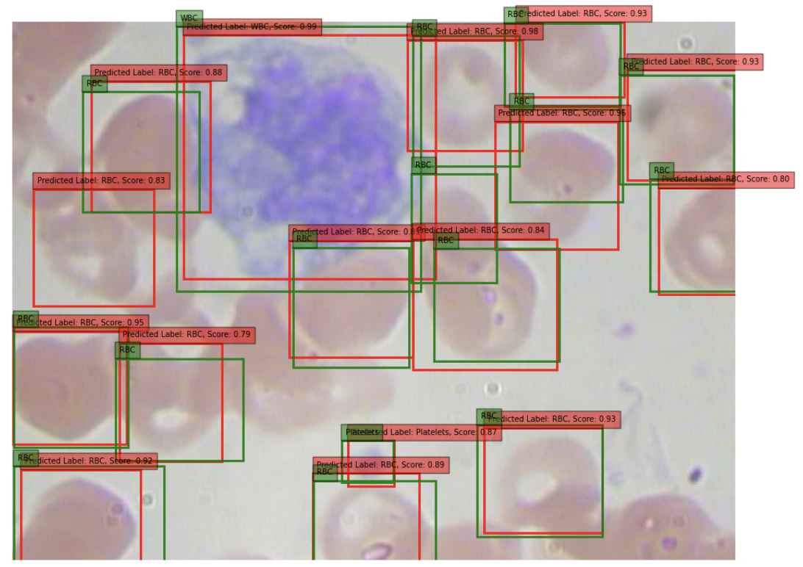

# R-CNN Model Classification of Blood Cells
Authors: [Shayla Tran](https://github.com/shaytran), [Kyle Deng](https://github.com/kt1720), and [Matthew Angoh](https://github.com/mattangoh)

### Materials
1. [Canva Presentation Link](https://www.canva.com/design/DAGCEbQBBcA/PAIfLsvr-iG_aeB65WWUzA/edit?utm_content=DAGCEbQBBcA&utm_campaign=designshare&utm_medium=link2&utm_source=sharebutton)
2. [Final Report](https://docs.google.com/document/d/1iAYaF60E2SaE3Sui7MzJriaIPZJeps9ty-6np5Zf-nQ/edit?usp=sharing)

## Table of Contents
1. [Introduction](#introduction)
2. [Methodology](#methodology)
3. [Experiment & Results](#experiment--results)
4. [Conclusion](#conclusion)

## Introduction
The integration of deep learning, particularly through Region-based Convolutional Neural Networks (R-CNNs) like the Faster R-CNN, has revolutionized medical imaging by enabling precise localization and classification of blood cells. This method overcomes traditional limitations by utilizing a region proposal network (RPN) that enhances the speed and accuracy of the model, crucial for effective diagnostics in hematological settings. By adapting and evaluating a pre-trained Faster R-CNN model on the BCCD dataset[^1], this study explores and demonstrates the efficacy and accuracy of our implemented R-CNN model on blood classification.

## Methodology
**Model Selection**

Ee chose the two-stage Faster R-CNN model over single-stage detectors like YOLO for blood cell classification due to its superior accuracy, despite the greater computational cost. This decision aligns with our goal of precise cell type classification over real-time detection, as empirical evidence suggests Faster R-CNN delivers higher mean average precision on complex image datasets. The availability of a pre-trained Faster R-CNN model in the PyTorch library further justified its selection, streamlining development and focusing on achieving the highest fidelity in diagnostic imaging.

**Data Extraction & Preparation**

We started with the structuring and preprocessing of the BCCD dataset for compatibility with the PyTorch fasterrcnn_resnet50_fpn model. The dataset includes:

* __Annotations__ - detailed XML files for object detection
* __ImageSets__ - split definitions for training, validation, and test sets
* __JPEGImages__ - the raw image data in JPEG format

Utilizing Python’s PIL library and the `xml.etree.ElementTree` parser, we loaded images, standardized them to RGB, and extracted bounding box annotations. A custom `BCCDDataset` class derived from `torch.utils.data.Dataset` was crafted to manage this data, outputting processed image tensors and a corresponding target dictionary with bounding box coordinates and class labels, prepped for effective deep learning model training.

***Code snippet:***
```
class BCCDDataset(torch.utils.data.Dataset):
    def __init__(self, root, image_set, transforms=None):
        self.root = os.path.join(root, 'BCCD')
        self.transforms = transforms
        self.imgs_dir = os.path.join(self.root, 'JPEGImages')
        self.annos_dir = os.path.join(self.root, 'Annotations')
        split_file = os.path.join(self.root, 'ImageSets', 'Main', f'{image_set}.txt')
        with open(split_file, 'r') as file:
            self.imgs_ids = file.read().splitlines()

    def __getitem__(self, idx):
        img_path = os.path.join(self.imgs_dir, self.imgs_ids[idx] + '.jpg')
        anno_path = os.path.join(self.annos_dir, self.imgs_ids[idx] + '.xml')
        img = Image.open(img_path).convert("RGB")
        target = self.parse_annotations(anno_path)
        if self.transforms:
            img, target = self.transforms(img, target)
        return img, target

    def parse_annotations(self, annotation_path):
        tree = ET.parse(annotation_path)
        root = tree.getroot()
        boxes = []
        labels = []
        for obj in root.findall('object'):
            bbox = obj.find('bndbox')
            boxes.append([int(bbox.find('xmin').text), int(bbox.find('ymin').text),
                          int(bbox.find('xmax').text), int(bbox.find('ymax').text)])
            label = obj.find('name').text
            labels.append(label_map[label])
        boxes = torch.as_tensor(boxes, dtype=torch.float32)
        labels = torch.as_tensor(labels, dtype=torch.int64)
        return {'boxes': boxes, 'labels': labels, 'image_id': torch.tensor([idx])}
```

**Model Configuration, Training, Testing & Validation**

The Faster R-CNN, selected for its accuracy and speed in object detection, was enhanced with a ResNet50 backbone, fine-tuned to classify blood cells into three distinct classes plus background, making it ideal for clinical real-time analysis. Its integrated Region Proposal Network (RPN) enables quick region proposals, while the deep residual networks of ResNet50 ensure robust feature extraction without gradient issues. During training, we optimized key hyperparameters such as learning rate, momentum, and weight decay to balance model convergence and prevent overfitting. We employed metrics like loss, precision, recall, F1-score, and mean Average Precision (mAP) to quantitatively assess the model's ability to accurately predict cell types and localize cells. 

***Code snippet:***

Function for adapting the model
```
def get_model_instance_segmentation(num_classes):
    model = torchvision.models.detection.fasterrcnn_resnet50_fpn(pretrained=True)
    in_features = model.roi_heads.box_predictor.cls_score.in_features
    model.roi_heads.box_predictor = FastRCNNPredictor(in_features, num_classes)
    return model
```

## Experiment & Results
We employed the pre-trained fasterrcnn_resnet50_fpn model from PyTorch, modifying the final classification layer to accommodate the four classes in our BCCD dataset. 



*Figure 1 - Faster R-CNN model for object detection requires the input image through VGG layers, to the RPN that identifies candidate object locations. The RoI pooling layer and the fully connected layers classify the regions and refine the bounding boxes.*

Due to hardware constraints, we conducted limited hyperparameter tuning on three optimizers: SGD, Adam, and AdamW. SGD outperformed the others, achieving an mAP of 0.886 for RBCs and platelets.



*Figure 2 - The mAP produced by SGD is 0.886, while Adam and AdamW produced 0.843 and 0.866, respectively. Therefore, SGD was utilized as the optimizer in the final model.*

The final model, utilizing SGD with specific parameters, underwent 10 epochs of training, resulting in an mAP of 0.874 on the test set. Our model achieved an mAP of 0.874, with AP scores of 0.8064, 0.9633, and 0.8533 for WBCs, RBCs, and platelets, respectively.



*Figure 3 - The model’s confidence on the object inside the box belonging to its predicted label is above 0.75, which means the model makes more predictions than what was illustrated in the image. This is only one image out of the 72 images in the test set. Serves more as a diagnostic tool to ensure that the model is performing as desired rather than measuring the model's overall performance.*

While the model showed reasonable performance, there is room for improvement in RBC and platelet classification. Future work could explore advanced architectures and data augmentation strategies to enhance accuracy.

## Conclusion
This research demonstrates the potential of the Faster R-CNN framework with a ResNet50 backbone for automating blood cell classification, achieving a mean average precision of 87.4%. While the model effectively identified white blood cells, it showed areas for improvement in the classification of red blood cells and platelets. Future work will focus on exploring more sophisticated neural network architectures, expanding data augmentation, and employing fine-tuning and transfer learning to enhance accuracy across all cell types.

To ensure the model's practical applicability in clinical settings, further clinical validation and integration into diagnostic workflows are essential. The study highlights the balance needed between computational efficiency and precision in medical diagnostics. Ongoing advancements in model development and dataset expansion aim to refine the efficacy of automated systems, enhancing patient care and clinical decision-making. This foundation sets the stage for future deep learning applications in healthcare diagnostics.

[^1]: Biryukov. (2021). Blood cells classification. Retrieved from https://www.kaggle.com/code/valentinbiryukov/blood-cells-classification 
